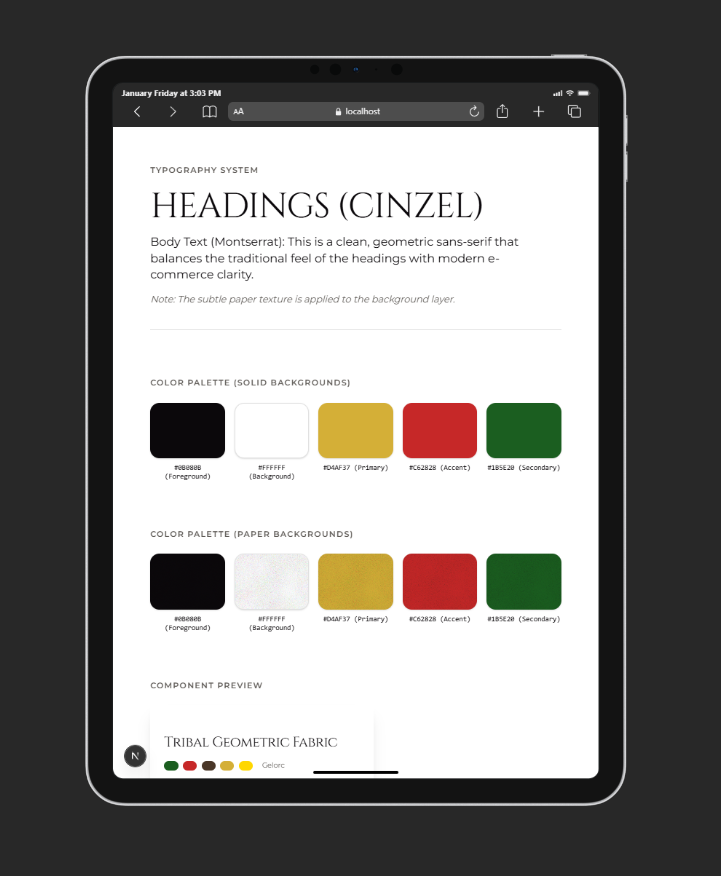

# Heritage & Hue | Authentic African Textiles

**A premium e-commerce and gallery platform designed to showcase the richness of African textile tradition through a modern, high-performance digital experience.**  
Built with a **"Culture-First" engineering mindset.**

---

## 🌟 Project Overview

**Heritage & Hue** is a specialized web application built for a client in the African textile industry. The goal was to bridge the gap between traditional craftsmanship and modern digital commerce. This project serves as a flagship piece in my professional portfolio, demonstrating my ability to translate complex design systems into scalable, high-performance code.

### The Vision

African cloths are more than just fabric; they are stories woven into geometric patterns. This platform treats every product as a piece of art, utilizing a custom-engineered design system that mimics the tactile feel of physical textiles.

---

## 🛠 Technical Stack

| Technology     | Purpose |
|---------------|---------|
| **Next.js**   | React Framework for Server-Side Rendering (SSR) and optimized performance |
| **TypeScript**| Ensuring type-safety and robust code architecture |
| **Tailwind CSS** | Utility-first styling for rapid, responsive UI development |
| **shadcn/ui** | High-quality, accessible component primitives |
| **OKLCH Colors** | Leveraging the modern color space for consistent perceived brightness and contrast |
| **SVG Engine** | Custom fractal noise and tileable patterns for organic textures |

---

## 🎨 Engineering the Design System



One of the highlights of this project is the **Tactile Design Engine**. Unlike standard flat web designs, this project implements:

### 1. Mottled Texture Implementation

To replicate the organic feel of handmade paper and fabric, I engineered a custom SVG Filter using `feTurbulence` (fractal noise).

**Technical Detail:**  
The texture is applied via CSS `mix-blend-mode: multiply` on pseudo-elements, allowing brand colors to retain their vibrancy while gaining physical depth.

### 2. Tribal Border System

A bespoke, tileable SVG pattern system that acts as a visual anchor for the brand heritage. It is implemented using `background-repeat: repeat-x` to ensure seamless scaling across any screen width without losing resolution.

### 3. Modern Color Math

Utilizing OKLCH color variables. This ensures that the primary gold (`#D4AF37`) and secondary green (`#1B5E20`) maintain their visual integrity across different display types and accessibility modes.

---

## 🚀 Key Features

- **Responsive Architecture:** Fully fluid UI that adapts from ultra-wide monitors to mobile devices.
- **Dynamic Cloth Gallery:** A categorized viewing experience for Ankara, Mudcloth, and Kente fabrics.
- **Performance Optimized:** Leveraging Next.js Image optimization and lightweight SVGs to ensure sub-second load times.
- **Accessible UI:** Built following WAI-ARIA standards via shadcn/ui components.

---

## 📦 Installation & Setup

To run this project locally:

### Clone the repository
```bash
git clone https://github.com/aglago/mudcloth.git
````

### Install dependencies

```bash
npm install
```

### Run the development server

```bash
npm run dev
```

### Build for production

```bash
npm run build
```

---

## 📐 Architecture Principles

As an engineer, I prioritized:

* **Component Atomicity:** Breaking the UI into highly reusable components (e.g., `ClothCard`, `TextureWrapper`).
* **Dry CSS:** Using Tailwind `@theme` and utility classes to minimize CSS bundle size.
* **Scalability:** The project is structured to easily integrate with headless CMS platforms (like Sanity or Contentful) for future inventory management.

---

## 👩‍💻 About the Developer

**Samuella Manye Aglago**
**Software Engineer**

I am a detail-oriented engineer focused on building digital products that combine aesthetic excellence with technical rigor. My work centers on creating performant, accessible, and meaningful user experiences.

* **LinkedIn:** https://linkedin.com/in/samuella-aglago
* **Portfolio:** https://samuella.site
* **X Profile:** https://x.com/smaglago

---

## 📜 License

This project is developed for portfolio demonstration. All rights to the textile designs and brand identity belong to the client. Code is available under the MIT License.
